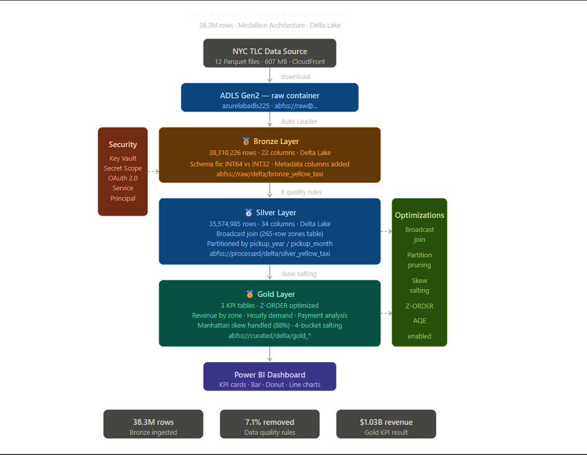
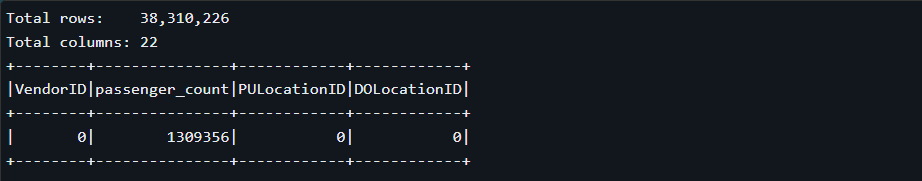
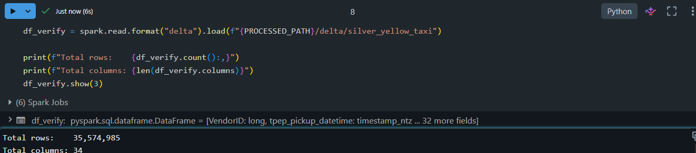
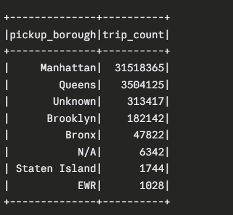
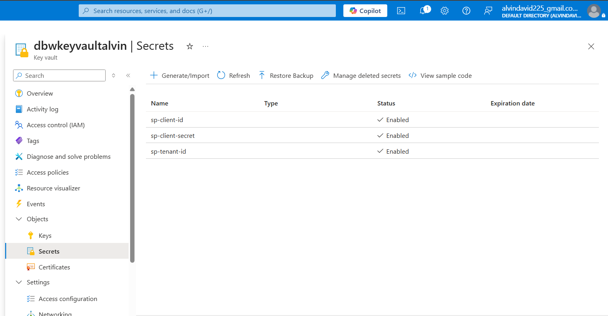
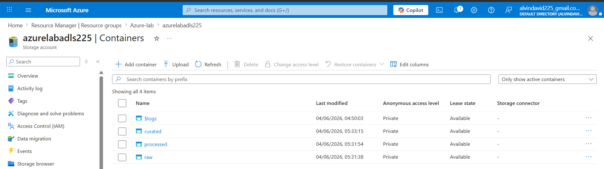

# 🚕 NYC Yellow Taxi — Azure Databricks Data Pipeline


Production-grade batch data pipeline processing **38.3 million NYC Yellow Taxi trip records** using the **Medallion Architecture** on Azure Databricks. Implements real-world data engineering challenges including schema mismatch resolution, data skew handling, broadcast joins, and Delta Lake optimizations.

---

## Architecture



```
NYC TLC Data Source (CloudFront)
         ↓
    ADLS Gen2 — raw container
    12 Parquet files · 607 MB
         ↓
  ── BRONZE LAYER ──────────────────────────────
  38,310,226 rows · 22 columns · Delta Lake
  Schema mismatch fixed (INT64 vs INT32)
  Metadata columns: ingestion_timestamp, source_file
         ↓
  ── SILVER LAYER ──────────────────────────────
  35,574,985 rows · 34 columns · Delta Lake
  8 data quality rules · 2.7M invalid rows removed
  Broadcast join with zone lookup · Partitioned by month
         ↓
  ── GOLD LAYER ────────────────────────────────
  3 KPI Delta tables · Z-ORDER optimized
  Manhattan skew handled with 4-bucket salting
         ↓
    Power BI Dashboard
```

---

## Screenshots

### Pipeline Output

<table>
<tr>
<td></td>
<td></td>
</tr>
<tr>
<td align="center"><b>Bronze — 38.3M rows ingested</b></td>
<td align="center"><b>Silver — 35.5M rows after cleaning</b></td>
</tr>
<tr>
<td></td>
<td></td>
</tr>
<tr>
<td align="center"><b>Skew proof — Manhattan 88% of trips</b></td>
<td align="center"><b>Key Vault — 3 secrets secured</b></td>
</tr>
</table>

### Azure Infrastructure

<table>
<tr>
<td></td>
</tr>
<tr>
<td align="center"><b>ADLS Gen2 — raw · processed · curated containers</b></td>
</tr>
</table>

---

## Tech Stack

| Component | Technology |
|---|---|
| Cloud Platform | Microsoft Azure |
| Processing Engine | Azure Databricks (Spark 3.4.1) |
| Storage | ADLS Gen2 (Azure Data Lake Storage) |
| Table Format | Delta Lake |
| Language | PySpark + Python 3.10 |
| Security | Azure Key Vault + Service Principal + OAuth 2.0 |
| Cluster | Single Node · Standard_D4ds_v4 · Runtime 13.3 LTS |
| Visualization | Power BI Desktop |

---

## Project Structure

```
nyc-taxi-azure-databricks-pipeline/
├── architecture/
│   └── architecture.png          # Pipeline architecture diagram
├── notebooks/
│   ├── 00_mount_adls.ipynb       # ADLS authentication + data ingestion
│   ├── 01_bronze.ipynb           # Bronze layer — raw Delta ingestion
│   ├── 02_silver.ipynb           # Silver layer — cleaning + enrichment
│   └── 03_gold.ipynb             # Gold layer — KPIs + optimizations
├── screenshots/
│   ├── bronze_output.png
│   ├── silver_output.png
│   ├── skew_proof.png
│   ├── adls_containers.png
│   └── keyvault_secrets.png
└── README.md
```

---

## Pipeline Details

### Security Setup

Credentials are never hardcoded. All secrets stored in Azure Key Vault and fetched at runtime via Databricks secret scope using OAuth 2.0.

```
Key Vault (sp-client-id, sp-tenant-id, sp-client-secret)
    → Databricks Secret Scope (kv-scope)
        → dbutils.secrets.get() in notebooks
            → Spark OAuth token exchange
                → ADLS Gen2 access via abfss://
```

- Service Principal `databricks-sp` assigned `Storage Blob Data Contributor` role on ADLS
- Secret scope `kv-scope` bridges Key Vault to Databricks notebooks
- OAuth 2.0 Client Credentials flow — tokens auto-refresh every hour

---

### Bronze Layer — `01_bronze.ipynb`

Raw ingestion from ADLS Gen2 into Delta Lake. No transformations — data preserved exactly as received.

**Challenge solved:** January 2023 files used `INT64` for location IDs while Feb–Dec used `INT32`. Auto Loader inferred schema from January, causing 92% of rows to land in `_rescued_data`. Diagnosed by checking null counts. Fixed by reading each monthly file independently with explicit type casting before union.

```python
# Read each file separately to avoid schema conflict
df = spark.read.parquet(path)
df_cast = (df
    .withColumn("VendorID",     col("VendorID").cast("long"))
    .withColumn("PULocationID", col("PULocationID").cast("long"))
    .withColumn("DOLocationID", col("DOLocationID").cast("long"))
    .withColumn("ingestion_timestamp", current_timestamp())
    .withColumn("source_file",         lit(filename))
    .withColumn("pipeline_name",       lit("nyc_taxi_bronze"))
)
```

| Metric | Value |
|---|---|
| Source files | 12 monthly Parquet files |
| Total rows | 38,310,226 |
| Columns | 22 (19 original + 3 metadata) |

---

### Silver Layer — `02_silver.ipynb`

Data cleaning, enrichment, and broadcast join with zone lookup table.

**8 data quality rules applied:**

```python
df_cleaned = (df_bronze
    .filter(col("fare_amount") > 0)
    .filter(col("trip_distance") > 0)
    .filter(col("passenger_count").between(1, 6))
    .filter(col("PULocationID").isNotNull())
    .filter(col("DOLocationID").isNotNull())
    .filter(col("tpep_dropoff_datetime") > col("tpep_pickup_datetime"))
    .filter(year(col("tpep_pickup_datetime")) == 2023)  # 2008/2009 rows found!
    .filter(duration_mins <= 180)                       # max 3-hour trip
    .dropDuplicates([...])
)
```

**Broadcast Join** — zone lookup table has 265 rows. Sending it to all executors eliminates shuffling 35M rows across the network.

```python
# Without broadcast: 35M rows shuffled across network
# With broadcast: 265-row table copied to each executor, zero shuffle
df_silver = df_cleaned.join(broadcast(df_zones), on="LocationID", how="left")
```

| Metric | Value |
|---|---|
| Rows after cleaning | 35,574,985 |
| Dirty rows removed | 2,735,241 (7.1%) |
| Columns | 34 (added zone names + time features) |
| Partitioning | pickup_year / pickup_month |

---

### Gold Layer — `03_gold.ipynb`

Business KPI aggregations with skew handling and query optimization.

**Data Skew:** Manhattan has 88% of all trips. Without handling, one Spark worker processes 31M rows while others process 180K — a 170x imbalance. Fixed using 4-bucket salting.

```python
SALT_BUCKETS = 4
df_salted = df_silver.withColumn("salt", (floor(rand() * SALT_BUCKETS)).cast("int"))

# Two-pass aggregation
df_partial = df_salted.groupBy("pickup_borough", "pickup_zone_name", "salt").agg(...)
df_result  = df_partial.groupBy("pickup_borough", "pickup_zone_name").agg(...)
```

**Z-ORDER** clustering reduces files scanned per query:
```sql
OPTIMIZE delta.`/delta/gold_revenue_by_zone`
ZORDER BY (pickup_borough, pickup_zone_name)
```

| Table | Description |
|---|---|
| `gold_revenue_by_zone` | Revenue by borough and zone |
| `gold_hourly_demand` | Trip count and revenue by hour and day |
| `gold_payment_analysis` | Breakdown by payment type |

---

## Key Results

| Metric | Value |
|---|---|
| Raw rows ingested | 38,310,226 |
| Clean rows after Silver | 35,574,985 |
| Dirty data removed | 2,735,241 (7.1%) |
| Top revenue zone | JFK Airport — $153M |
| Peak demand | Friday 6 PM — 411,999 trips |
| Credit card share | 81.9% of all trips |
| Total pipeline revenue | $1.03 Billion |
| Manhattan skew | 88.6% of all trips |

---

## Challenges Solved

| Challenge | Root Cause | Solution |
|---|---|---|
| Schema mismatch across 12 files | January used INT64, rest used INT32 | Read each file independently, explicit cast |
| 92% rows in `_rescued_data` | Auto Loader inferred schema from January | Switched to batch read with explicit StructType |
| DBFS mounts disabled | Unity Catalog workspace restriction | Direct `abfss://` paths with OAuth |
| Key Vault RBAC errors | AzureDatabricks app missing Secrets User role | Step-by-step IAM role assignment |
| Manhattan data skew (88%) | Single partition overloaded | 4-bucket salting, two-pass aggregation |
| Wrong year timestamps | 2008/2009 rows in 2023 dataset | Year filter in Silver cleaning |
| 35M row shuffle | Joining large fact with small dimension | `broadcast()` hint eliminated shuffle |

---

## Setup Instructions

### Prerequisites
- Azure subscription (Pay-As-You-Go)
- Azure Databricks workspace (Premium or Trial)
- Azure Data Lake Storage Gen2
- Azure Key Vault

### Step 1 — Azure Infrastructure
```
1. Create ADLS Gen2 storage account (enable Hierarchical Namespace)
2. Create 3 containers: raw · processed · curated
3. Create Service Principal (App Registration in Azure AD)
4. Assign Storage Blob Data Contributor role to Service Principal
5. Create Key Vault and store 3 secrets:
   - sp-client-id
   - sp-tenant-id
   - sp-client-secret
```

### Step 2 — Databricks Setup
```
1. Create cluster: Single Node · Standard_D4ds_v4 · Runtime 13.3 LTS · Auto-terminate 30 min
2. Create Secret Scope linked to Key Vault:
   URL: https://<workspace>.azuredatabricks.net/#secrets/createScope
3. Run notebooks in order: 00 → 01 → 02 → 03
```

### Step 3 — Run Pipeline
```python
# Run in this order:
00_mount_adls.ipynb   # ADLS auth + data ingestion
01_bronze.ipynb       # Raw ingestion to Delta
02_silver.ipynb       # Cleaning + enrichment
03_gold.ipynb         # KPIs + optimizations
```

---

## Dataset

**NYC TLC Yellow Taxi Trip Records 2023**
- Source: NYC Taxi & Limousine Commission
- Files: 12 monthly Parquet files (~50 MB each)
- Total size: ~607 MB
- Rows: 38.3 million trips
- Download:
```
https://d37ci6vzurychx.cloudfront.net/trip-data/yellow_tripdata_2023-{MM}.parquet
```

---

## Author

**Alvin David**
- GitHub: [@AlvinDavid225](https://github.com/AlvinDavid225)

---

## License

MIT License — see [LICENSE](LICENSE) for details.
